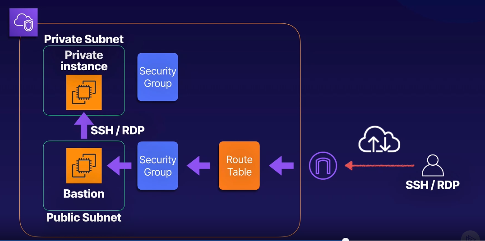
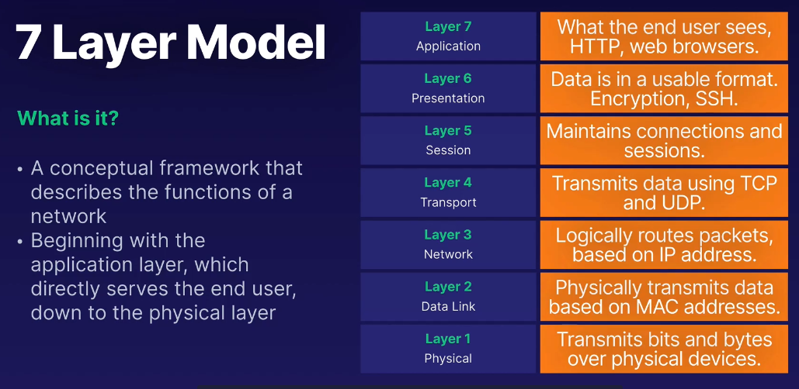
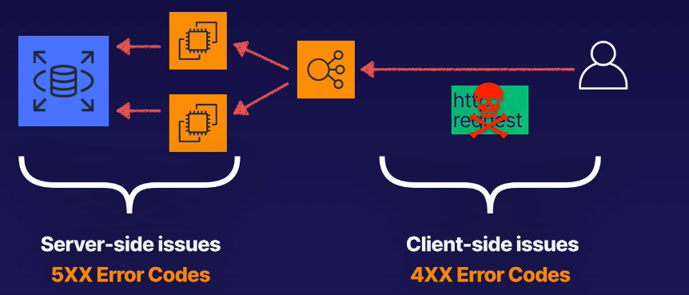
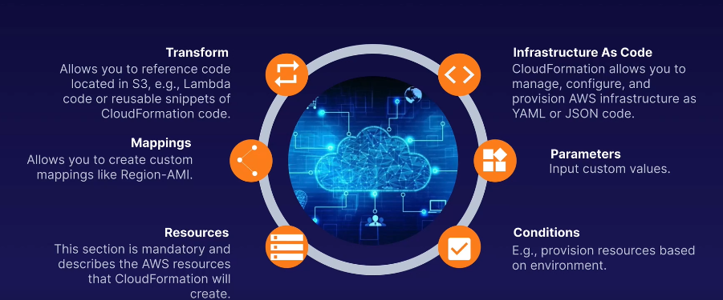
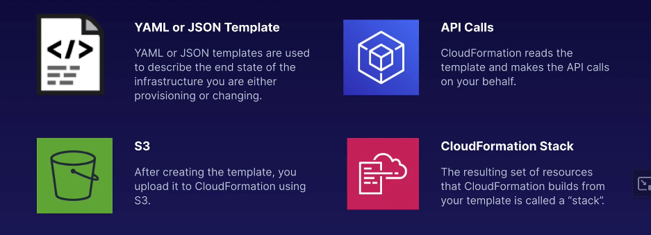
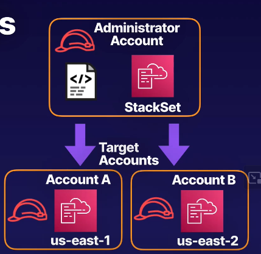
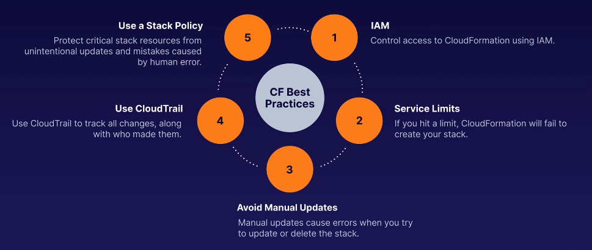
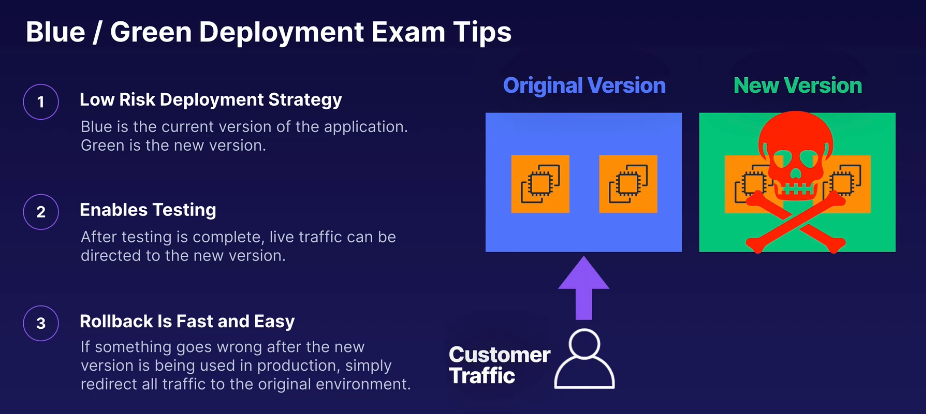
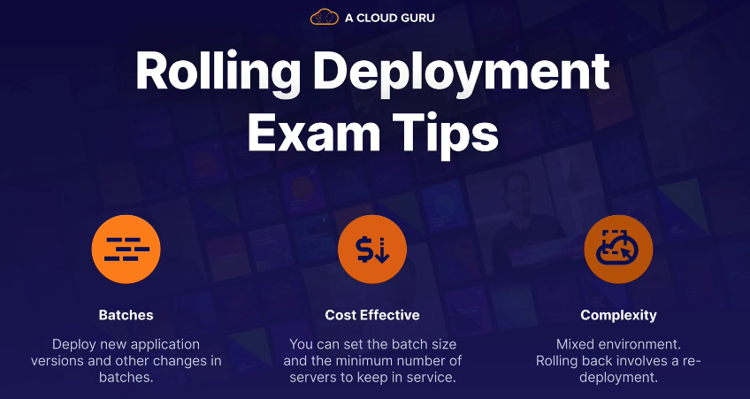

- [Course details](#course-details)
- [Section 3 : Deployment, Provisioning, and Automation](#section-3--deployment-provisioning-and-automation)
  - [Elastic Block Store (EBS)](#elastic-block-store-ebs)
    - [Notes](#notes)
    - [Exam Tips](#exam-tips)
  - [Bastion](#bastion)
  - [Elastic Load Balancer (ELB)](#elastic-load-balancer-elb)
    - [Types](#types)
    - [Application Load Balancer](#application-load-balancer)
    - [ELB Error Messages](#elb-error-messages)
    - [***CLOUDWATCH Exam Tips***](#cloudwatch-exam-tips)
    - [ELB Routing Requests](#elb-routing-requests)
  - [EC2 Image Builder](#ec2-image-builder)
    - [Steps](#steps)
  - [EC2 Image Builder Terminology](#ec2-image-builder-terminology)
    - [**Exam Tips**](#exam-tips-1)
    - [Steps](#steps-1)
    - [Packer VS EC2 Builder](#packer-vs-ec2-builder)
  - [CLOUDFORMATION](#cloudformation)
    - [CF process](#cf-process)
    - [Templates CloudFormation](#templates-cloudformation)
    - [CloudFormation StackSets](#cloudformation-stacksets)
    - [CF Errors](#cf-errors)
    - [Exam Tips](#exam-tips-2)
  - [Blue / Green Deployments](#blue--green-deployments)
  - [Rolling Deployments](#rolling-deployments)
  - [Canary Deployments](#canary-deployments)
  - [Systems Manager](#systems-manager)
  - [OPSWorks](#opsworks)
- [Section 4 : Monitoring, Logging and remediation](#section-4--monitoring-logging-and-remediation)
  - [CloudWatch Dashboards](#cloudwatch-dashboards)
  - [CloudWatch Logs](#cloudwatch-logs)
    - [Terminology](#terminology)

# Course details

- [AWS Certified SysOps Admin - Associate (SOA-C02)](https://app.pluralsight.com/library/courses/aws-certified-sysops-admin---associate/exercise-files)
- [Course Resources](https://github.com/ACloudGuru-Resources/course-aws-sysops-administrator-associate/tree/main)

# Section 3 : Deployment, Provisioning, and Automation

## Elastic Block Store (EBS)

### Notes

- Highly Available / Duplicated within an Availability Zone
- Type :
  - General Pupose SSD GP2 / GP3 up to 16000 IOPS
  - Provisioned IOPS SSD IO1 / IO2 : High perf needs up to 64000 IOPS
  - IO2 Block Express 
  - Optimized HDD ST1 : designed for long term storage
  - Cold HDD SC1 : lowest cost 

[Understanding EBS Volumes, Amazon EBS volume types](https://docs.aws.amazon.com/AWSEC2/latest/UserGuide/ebs-volume-types.html)

### Exam Tips

- EBS SSD 
  - GP2 / GP3 
    - Up to 16000 IOPS
    - Boot disks / general applications
  - IO1 / IO2 
    - Up to 64 000 IOPS
    - Up to 500 IOPS per GiB (50 for io1)
    - OLTP online Transaction processing / Latency sensitive
  - IO2 Block Express (SAN on cloud)
    - Up to 64 TB, 256000 IOPS
    - Large / critical, HP app (SAP HANA, Oracle, DB Server )
- EBS HDD
  - ST1 (not bootable)
    - Throuput optimized for Big Data, Data Warehouse, ...
    - Up to 500 MB /s
  - SC1 (not bootable)
    - Max throuput 250 MB / S
    - Less frequently accessed data

## Bastion

- A secure entry point to my infra

- Bastion is an instance created on a public subnet with a public IP
- Private instance is in a praivate subnet
- we need to securitygroup
  - Bastion : enable public access on SSH to bastion
  - **Private : enable ssh connection only from bastion**
- Internet Gateway and RouteTable needed route traffic in/out to bastion

## Elastic Load Balancer (ELB)

### Types

- Application Load Balancer : HTTP / HTTPS : Layer 7
- Network load balancer :  TCP High Perf : Layer 4 
- Classic load balancer : HTTP/HTTPS/TCP (Legacy option)
- Gateway Load Balancer :
  - Load balance workloads for third-party virtual appliances running on AWS (virt FW, IDS, IPS, ...)


### Application Load Balancer

- we can lanipulate X-Forwarded-For Header to identify original IP
- On a target Group, we can select 
  - EC2 Instance 
  - Ip Address (Same subnet)

### ELB Error Messages

- Client Side : Error 4XX
  - HTTP 400 : Bad request
  - HTTP 408 : Request Timeout
  - HTTP 464 : using unsuported protocol
- Server Side : Error 5XX
  - HTTP 504 : Gateway Timeout
  - HTTP 502 : Target host unreachable
  - HTTP 503 : No registred targets



### ***CLOUDWATCH Exam Tips***
>
> - HealthyHostCount
> - TargetResponseTime
> - UnHealthyHostCount
> - HTTP Status Codes
> - RequestCount

- Access logs : capture information relating to incoming requestes to your ELB
- Disabled by default
- Enrypted when stored in S3 bucket

### ELB Routing Requests

- Based on Algo : Round Robin / Least Outstanding Resuest
- Sticky Session / Session affinity : based on session cookies send to same target (override the algo) : used when data session is stored localy in the server

## EC2 Image Builder

### Steps

- First Step : Base OS
- Second Step : Add software
- Third : Test
- Forth : Distribute

## EC2 Image Builder Terminology

- Image Pipeliner : Defines confi : end-to-end process
- Image Recipe : Image builder creates a recipe version controlled for each image ( Source image + Build components )

### **Exam Tips**

- AUTOMATED: EC2 Image Builder automates the process of creating and maintaining AMI and Container images.
- 4-STEP PROCESS: Select a base OS image, customize by adding software, test, and distribute to your chosen region.
- TERMINOLOGY : Image pipeline: Settings and process Image recipe: Source image and build components Build components: The software to include

### Steps

1. Create an IAM Role : Add permissions for EC2 Image Builder.
2. Create an Image Pipeline : This is where we'll define our configuration settings.
3. Execute the Pipeline : Notice Image Builder launches temporary 'build' and 'test' EC2 instances.
4. View the Image : We can view the image in Image Builder and from the EC2 console under AMIs

### Packer VS EC2 Builder

- Packer is an open-source tool developed by HashiCorp for creating machine images for multiple platforms from a single source configuration
- The EC2 Builder is a component within Packer specifically designed to create Amazon Machine Images (AMIs) for use in Amazon EC2 (Elastic Compute Cloud).

## CLOUDFORMATION



- Manage, configure and provision AWA infrastructure as code
- Stack policy : JSON file to define what actions are allowed on your stack

### CF process



### Templates CloudFormation

- Ressources Section is the only mandatory section 
- Transform Section can be used to include referencing additionnal code

- Example CloudFormation Template: EC2 Instance Creation

```YAML
AWSTemplateFormatVersion: '2010-09-09'
Description: Simple CloudFormation Template to create an EC2 instance

Parameters:
  InstanceType:
    Description: EC2 Instance Type
    Type: String
    Default: t2.micro
    AllowedValues:
      - t2.micro
      - t2.small
      - t2.medium
    ConstraintDescription: Must be a valid EC2 instance type.

Resources:
  MyEC2Instance:
    Type: 'AWS::EC2::Instance'
    Properties:
      InstanceType: !Ref InstanceType
      ImageId: ami-0c55b159cbfafe1f0  # Update this to the latest AMI in your region
      SecurityGroups:
        - !Ref MyEC2SecurityGroup

  MyEC2SecurityGroup:
    Type: 'AWS::EC2::SecurityGroup'
    Properties:
      GroupDescription: Enable SSH access via port 22
      SecurityGroupIngress:
        - IpProtocol: tcp
          FromPort: '22'
          ToPort: '22'
          CidrIp: 0.0.0.0/0  # Caution: This allows SSH access from anywhere. Narrow this down for production environments.

Outputs:
  InstanceId:
    Description: The Instance ID
    Value: !Ref MyEC2Instance

```

### CloudFormation StackSets

- Manage CF Stack on multiple aws account/ Region
- Configure IAM permissions using cross-account roles. Steps:
  - In your administrator account, create the IAM role (where we will run CF): ***AWSCloudFormationStackSetAdministrationRole***
  - In your administrator account, create a service that can assume role
  - In your target accounts, create the Service role: ***AWSCloudFormationStackSetExecutionRole***
  - ***AWSCloudFormationStackSetAdministrationRole*** is allowed to assume ***AWSCloudFormationStackSetExecutionRole*** and provision resources in the target account.
- Ressource Access Manager : allow sharing ressources with other accounts



### CF Errors

- IAM insuficient permessions de to create EC2 instances (where running Cloudformation)
- Limts exceded
- Failed Rollback :
  - making modification manualy outside CF template (statefull)
  - Ressources doesn't exist anymore

### Exam Tips



## Blue / Green Deployments



## Rolling Deployments

- allow deployment of new version in a certain number of ressources 
- It can reduces costs comparing to Blue / Green Deployments


## Canary Deployments

- Like Rolling Deployments with possiblilty to deploy new version on 10% of ressources and redirect a small portion of costumer to this version 
- Enable Canary Testing with a small portion before roll out to 100 % of ressource

## Systems Manager

- What Is Systems Manager? 
  - **Management Tool** : Visibility and control over your AWS infrastructure.
  - **Inventory of Your EC2 Instances** : Organize and group resources together by application or environment, even including on- premises systems.
  - **Automation** : Automate common operational tasks on multiple systems simultaneously, like patching, installing applications, running scripts, etc.

- Inventory and automation
- Run command : We can run a pre defined command on a EC2 instances
- Patch Manager 

## OPSWorks

- A configuration management Serice compatible with Puppet and Chef
- OpsWorks Stacks :
  - Automate installation of stack (DB, LB and EC)
  - MAnaged Services : Puppet / Chef
  - management configuration tool

# Section 4 : Monitoring, Logging and remediation

## CloudWatch Dashboards

- Default metrics are included to any EC2 instance : CPU, Network, disk and status check
- Collecting any system level metrics or any other logs we have to install CloudWatch agent on instances
- Default interval is 5 Min it can be reduced to 1 sec if needed (Extra charge)

> Exam tips: CloudWatch Dashboards : a Custom View, Multi-Region , Should be saved

## CloudWatch Logs

- Centralized logs : Application, Services and system logs
- View, Search and Filter
- Notifications based on alert configuration

### Terminology

- Log Events : message & time stamp
- Log Stream : sequence of log events
- Log Group : contains log streams (used to manage retention, access, ... to many log streams)

